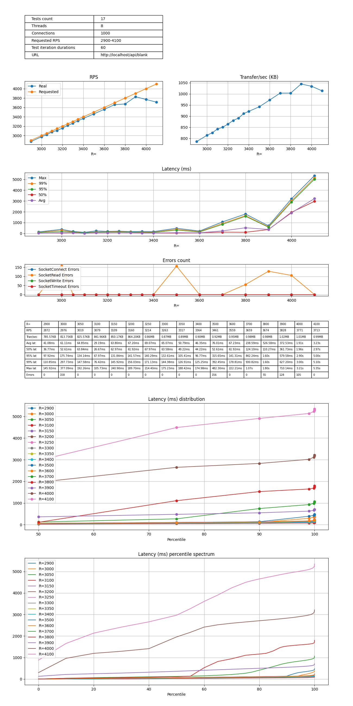
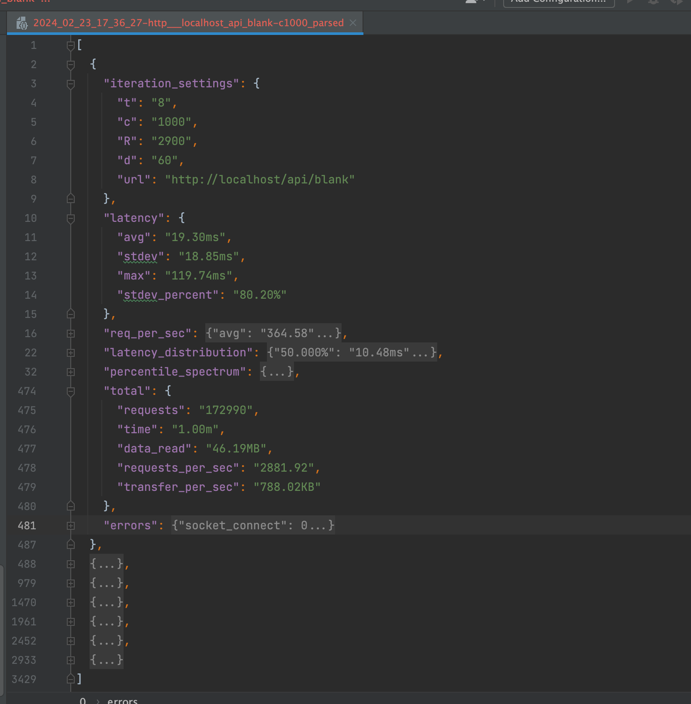

# WRK helper
A script for automating web application performance testing using [wrk](https://github.com/wg/wrk), [wrk2](https://github.com/giltene/wrk2), or [wrkx](https://github.com/devhands-io/wrkx) (Alexey Rybak's version with bug fixes and improvements). It runs a series of tests with different parameters and generates graphs.

## Basic Usage
python runner.py http://localhost -R 1000 2000 1000 -t8 -d60 -c 512
```
Helper for wrk

positional arguments:
  url           Url

options:
  -h, --help    show this help message and exit
  -R R R R      RPS start stop step for generation RPS parameter string, eg -R 100 1000 200
  -t T          Number of threads (default: $DEFAULT_THREADS)
  -d D          Duration
  -c C [C ...]  connections, eg -c 512 1024
```

### Running Tests
`./wrk_helper.sh -t4 -c"100,500" -R"100,500,1000,3000" -d60 http://localhost`
### Data parsing and chart generation 
`python wrk_parser.py 2024_02_19_02_02_31-http___localhost-c100.txt`

## Command Line Options
```
Usage: ./wrk_helper.sh [OPTIONS] <url>

Options:
  -h                Display this help message
  -t <threads>      Number of threads (default: 1)
  -c <connections>  Array of numbers of connections (eg: "50,100,1000") (default: 1)
  -R <RPS>          Array of requests per second (eg: "50,100,1000") (default: 100)
  -d <duration>     Test duration (default: 30)
  -s <sleep>        Sleep between iterations (default: 30)
  -p <exec path>    Path to wrk executable (default: wrk)
  -v <verbose>      Duplicate wrk output to console
```

## Previews
### Basic Usage


### Data parsing and chart generation


